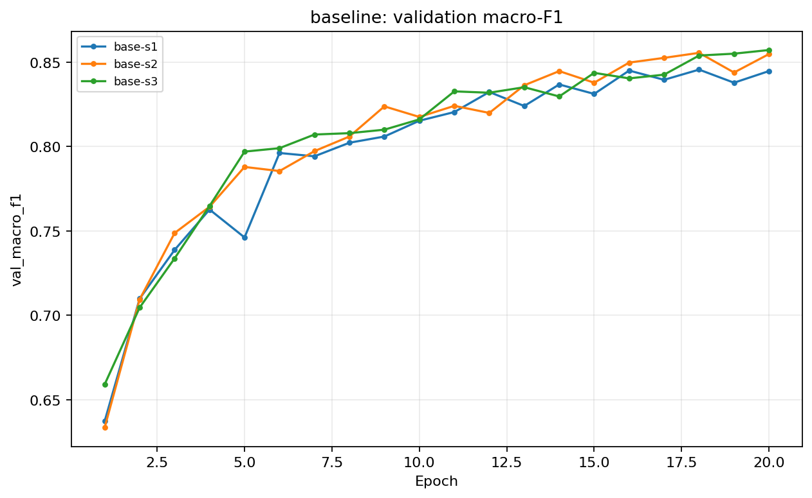
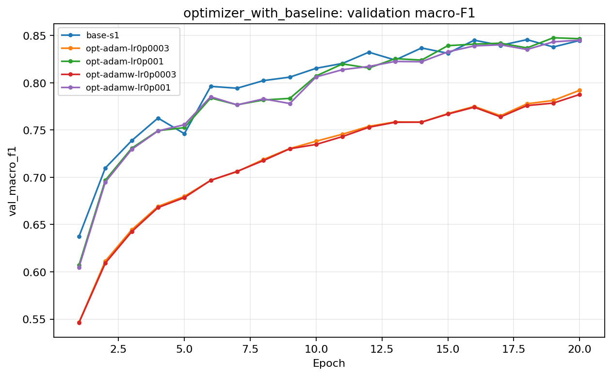
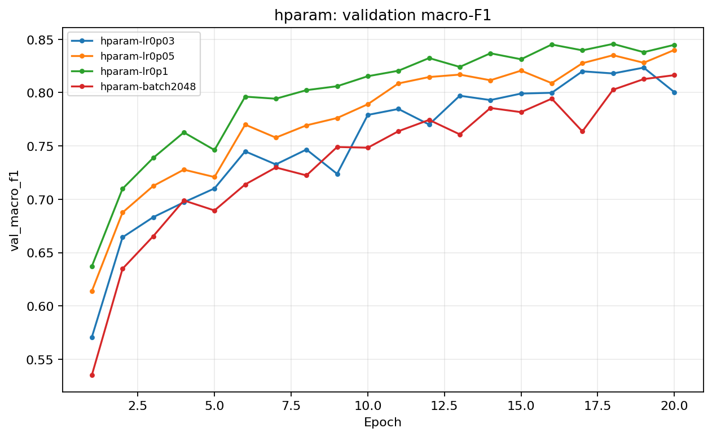
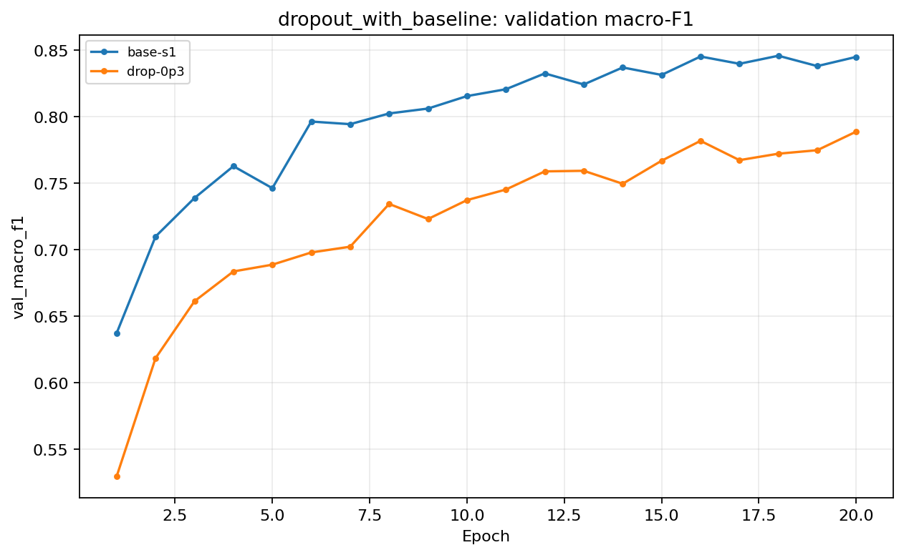
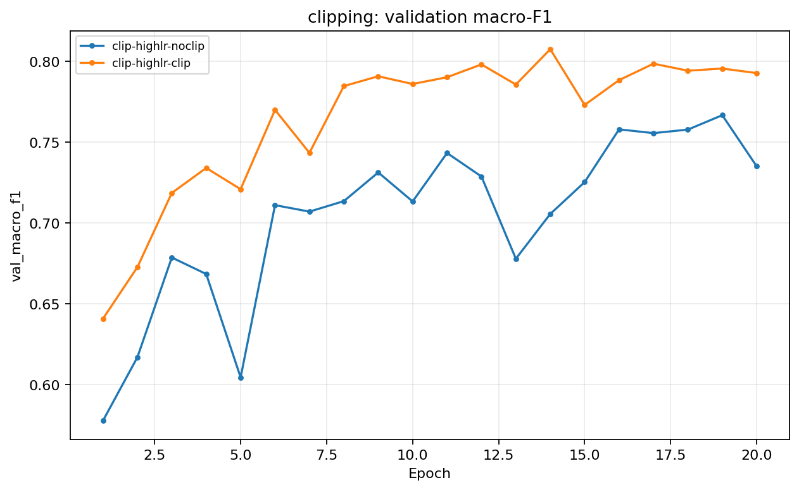
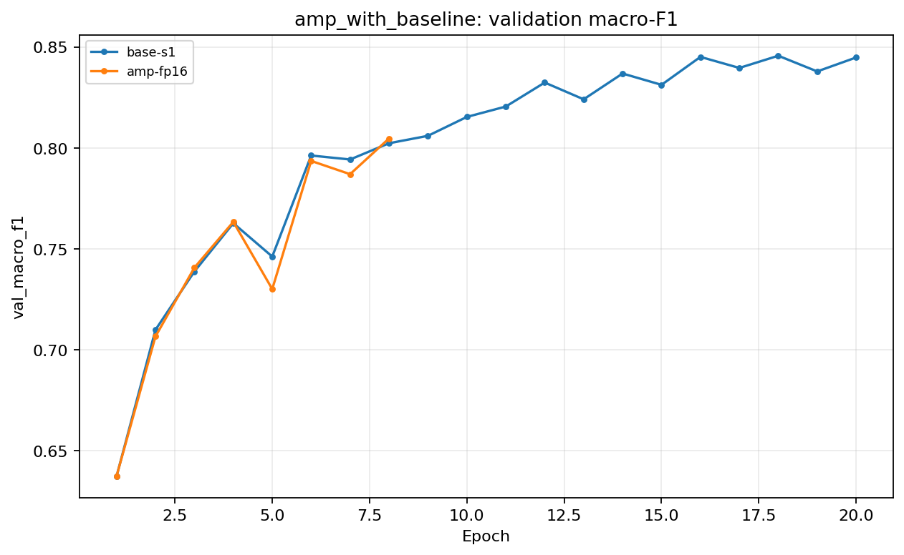
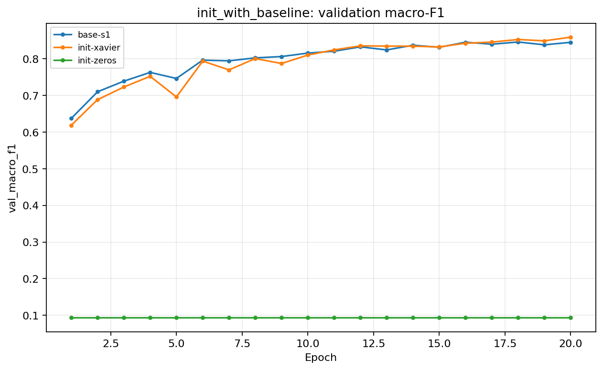
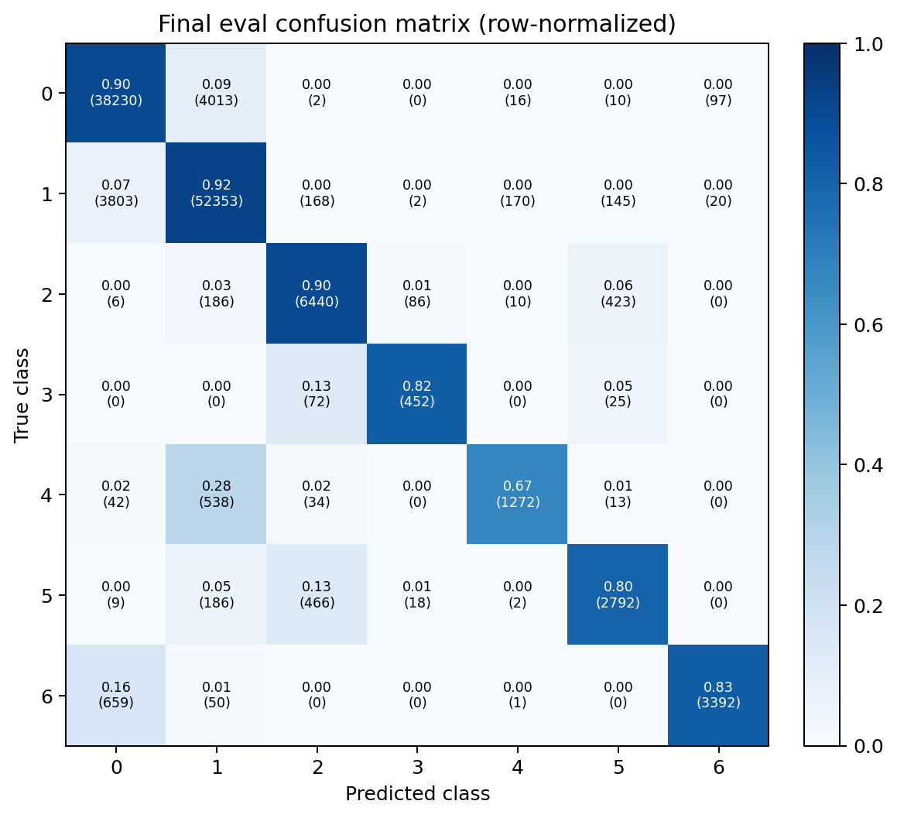

# Báo cáo Lab Day 1 - Đỗ Mạnh Đoan - MSSV 2A202602839 

## 1. Thiết lập

- Môi trường: Python 3.10, PyTorch 2.11.0+cu128, NVIDIA GeForce RTX 3060 12 GB.
- Dữ liệu Forest CoverType được chia cố định bằng `split_metadata.csv`: 464.809 train và 116.203 eval. Tôi tách 20% validation từ train bằng phân tầng, seed 42, còn 371.847 train và 92.962 validation. Mean/std chỉ được fit trên 10 cột số của train; eval không được dùng trước khi khóa cấu hình cuối.
- M-base: `54→256→128→7`, ReLU, 47.879 tham số. Baseline: He, cross-entropy, SGD momentum 0,9, lr 0,1 chọn bằng validation, batch 512, 20 epoch, FP32, không dropout/clipping.
- Mốc đoán lớp đa số trên validation: accuracy 0,4876, macro-F1 xấp xỉ 0,094.
- Đã thử đủ bảy chủ đề: loss, optimizer, hyperparameter, dropout, clipping, mixed precision và initialization. Mỗi run có JSON, dòng Excel và PNG cùng `exp_id`.

## 2. Kiểm tra ban đầu và độ nhiễu

| Kiểm tra | Kết quả |
|---|---|
| Số tham số / shape logits | 47.879 / `(B, 7)` |
| Loss bước 0, seed kiểm tra 2 | 1,978157; gần `ln(7)=1,945910` |
| Overfit 20 mẫu | loss 2,360×10⁻⁶; accuracy 100% sau 500 bước |
| Gradient của mọi tham số | khác `None` và khác 0 |
| Baseline | 3 seed: `base-s1`, `base-s2`, `base-s3` |
| Baseline val accuracy | 0,909913 ± 0,003778 |
| Baseline val macro-F1 | 0,851596 ± 0,005891 |

Ngưỡng nhiễu dùng khi kết luận là `2σ = 0,011782` macro-F1. Vì vậy chênh lệch nhỏ hơn mức này được xem là chưa đủ bằng chứng về ưu thế ổn định.

## 3. Kết quả thí nghiệm trên validation

### 3.1 Loss: CE và MSE

**Dự đoán trước:** CE sẽ học nhanh và đạt macro-F1 cao hơn vì gradient theo logit không bị thêm đạo hàm bão hòa của softmax; không so trực tiếp trị số CE và MSE vì khác thang đo.

`loss-mse` đạt macro-F1 0,733571 và accuracy 0,871066, thấp hơn `base-s1` lần lượt 0,111224 và 0,035003. Gradient norm trung bình của MSE là 0,088 so với 0,574 của CE, phù hợp với hội tụ chậm hơn. Dự đoán được xác nhận và chênh lệch lớn hơn nhiễu seed.

### 3.2 Optimizer

**Dự đoán trước:** Adam/AdamW sẽ nhạy ít hơn ở giai đoạn đầu, nhưng kết luận chỉ hợp lệ khi mỗi optimizer được chỉnh learning rate riêng.

| Optimizer | LR tốt nhất đã thử | `exp_id` | Val macro-F1 |
|---|---:|---|---:|
| SGD momentum | 0,1 | `base-s1` | 0,844795 |
| Adam | 0,001 | `opt-adam-lr0p001` | 0,846665 |
| AdamW | 0,001 | `opt-adamw-lr0p001` | 0,845133 |

Adam và AdamW ở lr 0,0003 chỉ đạt 0,792073 và 0,787664. Khi chỉnh lr công bằng, ba optimizer gần như ngang nhau: chênh lệch tốt nhất chỉ 0,001870, nhỏ hơn `2σ`. Do đó không thể kết luận Adam thắng SGD; kết luận sẽ sai nếu chỉ dùng cùng một lr cho mọi optimizer. AdamW có weight decay 0,01 nên không phải bản sao hoàn toàn của Adam.

### 3.3 Hyperparameter

**Dự đoán trước:** lr quá nhỏ sẽ chưa hội tụ trong 20 epoch; batch 2048 nhanh hơn mỗi epoch nhưng có ít bước cập nhật hơn batch 512 nên có thể giảm chất lượng nếu giữ nguyên lr/epoch.

SGD momentum tăng từ lr 0,03 → 0,05 → 0,1 cho macro-F1 0,823411 → 0,839970 → 0,844795; vì vậy khóa baseline lr 0,1 bằng validation. `hparam-batch2048` chỉ đạt 0,816375, giảm 0,028420 so với batch 512, vượt nhiễu. Nó nhanh hơn rõ rệt (0,326 so với 1,316 giây/epoch), nhưng mỗi epoch chỉ có khoảng một phần tư số bước cập nhật; cùng 20 epoch không đồng nghĩa cùng lượng tối ưu hóa.

### 3.4 Dropout

**Dự đoán trước:** dropout 0,3 sẽ không giúp khi M-base chưa quá khớp mạnh và có thể gây underfit.

`drop-0p3` đạt macro-F1 0,788678, thấp hơn baseline 0,056117. Khoảng cách final val–train loss giảm từ 0,02037 xuống 0,00457, nhưng cả train lẫn validation đều kém hơn; đây là giảm gap bằng underfit chứ không phải cải thiện tổng quát hóa. Dropout chỉ nên tăng khi đường train tiếp tục tốt lên trong khi validation xấu đi.

### 3.5 Gradient clipping

**Dự đoán trước:** ở lr cao, clipping sẽ hạn chế bước cập nhật do gradient spike và ổn định hơn bản không clip; nó không làm tăng năng lực mô hình.

Từ gradient norm baseline, chọn `c=0,5756`, rồi tăng lr từ 0,1 lên 1,0. `clip-highlr-noclip` đạt 0,734929; `clip-highlr-clip` đạt 0,807330, tăng 0,072401 nhưng vẫn thấp hơn baseline. Điều này cho thấy clipping cứu được một phần cấu hình lr quá cao, không biến lr xấu thành tối ưu. History lưu norm trước clip; tuy nhiên chưa lưu tỷ lệ batch thực sự vượt `c`, nên không định lượng được tần suất kích hoạt — đây là một hạn chế.

### 3.6 Mixed precision

**Dự đoán trước:** mạng rất nhỏ nên FP16 có thể không nhanh hơn vì kernel-launch overhead chi phối.

FP32 baseline mất 1,316 giây/epoch và peak memory 160,4 MB. `amp-fp16` mất 1,866 giây/epoch, không giảm peak memory đo được và xuất hiện gradient không hữu hạn ở epoch 8; best macro-F1 trước khi dừng là 0,804684. Kết quả xác nhận mixed precision không có lợi cho workload nhỏ này. Phần lớn tensor dữ liệu và master weights vẫn FP32, trong khi autocast/GradScaler tạo thêm overhead. Pipeline hiện dừng khi gặp norm không hữu hạn thay vì cho GradScaler tiếp tục hạ scale; đây cũng là một hạn chế triển khai cần nêu rõ.

### 3.7 Khởi tạo tham số

**Dự đoán trước:** zeros sẽ làm các neuron cùng lớp đối xứng và ReLU tại 0 chặn gradient về lớp ẩn; Xavier có thể cho activation nhỏ hơn He nhưng vẫn học được.

| Init | Activation std sau ba Linear ở bước 0 | Step-0 loss | Val macro-F1 |
|---|---|---:|---:|
| He (`base-s1`) | 0,671 / 0,649 / 0,588 | 2,2691 | 0,844795 |
| Xavier (`init-xavier`) | 0,280 / 0,221 / 0,195 | 2,0222 | 0,858835 |
| Zeros (`init-zeros`) | 0 / 0 / 0 | 1,9459 | 0,093650 |

Zeros dừng ở đúng mức đoán lớp đa số, xác nhận lỗi đối xứng. Xavier cao hơn He 0,014040 trên seed 1, vừa vượt `2σ`; tuy nhiên khi xét ba seed Xavier, mean là 0,857213 ± 0,001476 và cải thiện eval cuối không vượt nhiễu baseline, nên kết luận ưu thế phải thận trọng. Mạng chỉ có hai lớp ẩn nên khác biệt truyền phương sai không cực đoan như mạng ReLU rất sâu.

## 4. Đánh giá cuối trên eval

Cấu hình cuối được khóa trong `results/final_config_lock.json` trước khi chạy `evaluate.py`: M-base, Xavier, CE, SGD momentum 0,9, lr 0,1, batch 512, 20 epoch, FP32, không dropout/clipping. Quy tắc chọn là macro-F1 validation cao nhất trong các ứng viên 20 epoch không mang tính phản chứng.

| Cấu hình | Seed nộp | Val macro-F1 | Eval macro-F1 | Eval accuracy |
|---|---:|---:|---:|---:|
| Baseline `base-s1` | 1 | 0,844795 | 0,847887 | 0,904684 |
| Final `init-xavier` | 1 | 0,858835 | **0,855695** | **0,902997** |

Final tăng eval macro-F1 0,007808 nhưng accuracy giảm 0,001687. Cải thiện macro-F1 nhỏ hơn `2σ=0,011782`, nên chưa đủ bằng chứng rằng Xavier ổn định hơn He. Val và eval của final lệch 0,003140, cho thấy phép chia validation phân tầng đại diện tương đối tốt.

### 4.1 Phân tích lỗi theo lớp

| Lớp | Support | Precision | Recall | F1 |
|---:|---:|---:|---:|---:|
| 0 | 42.368 | 0,8943 | 0,9023 | 0,8983 |
| 1 | 56.661 | 0,9133 | 0,9240 | 0,9186 |
| 2 | 7.151 | 0,8967 | 0,9006 | 0,8986 |
| 3 | 549 | 0,8100 | 0,8233 | 0,8166 |
| 4 | 1.899 | 0,8647 | 0,6698 | **0,7549** |
| 5 | 3.473 | 0,8192 | 0,8039 | 0,8115 |
| 6 | 4.102 | 0,9667 | 0,8269 | 0,8913 |

Lớp 4 khó nhất. Có 538/1.899 mẫu lớp 4 bị dự đoán thành lớp 1. Precision cao nhưng recall thấp cho thấy model bảo thủ khi dự đoán lớp hiếm này. Lớp 4 chiếm khoảng 1,6%, còn lớp 1 chiếm 48,8%; mất cân bằng là nguyên nhân hợp lý, nhưng mức độ giống nhau về đặc trưng cần phân tích thêm trước khi khẳng định. Hướng tiếp theo là class-weighted CE hoặc balanced sampling, vẫn phải chọn bằng validation.

## 5. Trả lời câu hỏi dẫn dắt

1. **Optimizer nào thắng?** Sau khi chỉnh lr, Adam 0,001 cao nhất trong nhóm optimizer nhưng chỉ hơn SGD momentum 0,001870, nhỏ hơn nhiễu. Nếu dùng lr 0,0003 cho Adam rồi so với SGD 0,1, kết luận sẽ đảo ngược; do đó phải so ở lr tốt nhất của từng optimizer.
2. **Dropout có giúp không?** Không trong M-base hiện tại: macro-F1 giảm 0,056117. Dropout phù hợp khi có gap train–validation tăng do overfit, không phải thuốc mặc định.
3. **Clipping giải quyết gì?** Nó giới hạn độ dài bước do gradient lớn. Ở lr 1,0, clipping tăng macro-F1 từ 0,734929 lên 0,807330, nhưng vẫn không thay thế việc chọn lr đúng.
4. **Mixed precision có nhanh hơn không?** Không. FP16 chậm hơn khoảng 42% và gặp overflow ở epoch 8. Mạng nhỏ không tạo đủ phép nhân ma trận để bù overhead autocast/GradScaler.
5. **Vì sao zeros hỏng; He khác Xavier?** Zeros giữ các neuron đối xứng và ReLU(0) làm gradient lớp ẩn mất tác dụng. He dùng phương sai `2/fan_in`, phù hợp ReLU làm mất khoảng nửa activation; Xavier dùng `2/(fan_in+fan_out)` và tạo activation nhỏ hơn trong phép đo này.
6. **Ba kiểm tra đầu tiên khi loss không giảm sau 2.000 bước:** (i) kiểm tra dữ liệu/nhãn/chuẩn hóa, shape, dtype và loss bước 0 để phát hiện lệch nhãn, leakage hoặc softmax hai lần; (ii) overfit 20 mẫu để cô lập lỗi trong forward–loss–backward–update; (iii) in gradient norm từng tham số và kiểm tra learning rate/cập nhật trọng số để phát hiện gradient bằng 0, không hữu hạn, quên `zero_grad` hoặc optimizer không nhận tham số. Chỉ sau ba bước này mới tăng độ rộng hoặc thời gian huấn luyện.

## 6. Hạn chế và điều bất ngờ

- Xavier tốt nhất trên validation nhưng cải thiện eval chưa vượt nhiễu baseline; không nên tuyên bố chắc chắn Xavier tốt hơn He.
- Chỉ ba seed cho baseline/final; các thí nghiệm kỹ thuật còn lại dùng một seed.
- FP16 diverge một phần do chính sách dừng ngay khi norm không hữu hạn; một pipeline production nên cho GradScaler bỏ bước và giảm scale trước khi kết luận.
- Clipping chưa ghi tỷ lệ batch bị clip, chỉ ghi norm trung bình trước clip.
- Cùng số epoch nhưng batch 2048 có ít bước cập nhật hơn; so sánh phản ánh ngân sách epoch chứ không phải ngân sách update bằng nhau.
- Không thử class weighting, sampler cân bằng hoặc scheduler vì eval đã được mở; đó là hướng nghiên cứu sau, không được dùng để chỉnh lại bài nộp này.

## 7. Phụ lục

- 20 run chính thức; mỗi run có `results/<exp_id>.json` và `figures/<exp_id>.png`.
- File khóa cấu hình: `results/final_config_lock.json`.
- File đánh giá chính thức: `eval_result.json`; dự đoán: `predictions_eval.csv`.
- Tổng thời gian huấn luyện chính khoảng 9 phút trên RTX 3060, chưa tính cài môi trường và hoàn thiện báo cáo.
